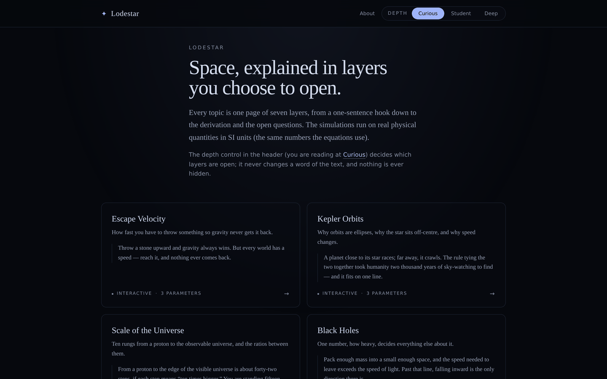
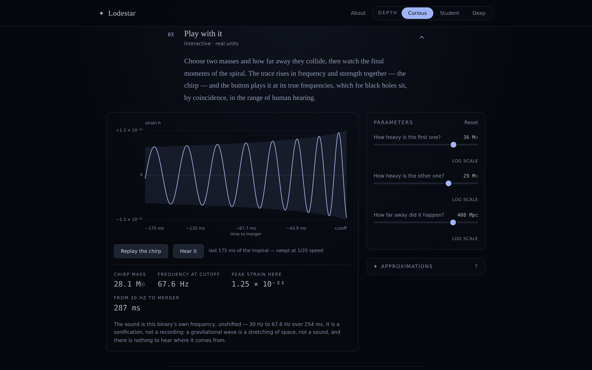

# Lodestar

Interactive astrophysics, explained in seven layers you choose to open.

**Live site: https://lodestar-nu-six.vercel.app**

Lodestar is an astrophysics education site. Every topic is one page of seven layers, from a one-sentence hook, through an everyday analogy and a live simulation, down to the derivation and the open research questions. A depth setting in the header (Curious, Student, Deep) decides which layers start open, and never changes a word of the text, so one module serves both a reader who has never studied physics and a reader who works in the field: the maths is on every page, folded shut by default.

## Screenshots





## Features

- Seven modules, each a seven-layer page: hook, intuition, interactive simulation, real picture, the maths, going deeper, connections. The depth tier persists across sessions via Zustand's `persist`.
- Simulations run on real SI quantities. Every control is a typed `Param` with a unit and a symbol, and the maths layer renders KaTeX from the same `Param` values the animation uses, so the number in the equation is the number in the physics.
- Readouts are recomputed, not tabulated: the gravitational-waves page derives chirp mass, frequency at cutoff, peak strain and time from 30 Hz to merger from `src/physics/gw.ts`.
- Each simulation lists its approximations in a counted expander beside it, not in the prose.
- The gravitational-wave chirp can be heard, synthesised through Web Audio at the binary's own frequencies and labelled on the page as a sonification, not a recording.
- Glossary of 46 entries. Marked terms open a panel placed by a pure geometry function, on hover intent, click, focus or tap, with one `aria-live` region for screen readers.
- Every module closes its "real picture" layer with a licensed photograph or published measurement (seven figures in `public/figures/`), credited on the page.
- All seven simulations honour `prefers-reduced-motion` with a static rendering carrying the same information.
- Constants follow CODATA 2018 and IAU 2015 Resolution B3, defined once and never inlined. Each module cites four or five primary references.

## Modules

| Module | The one idea |
|---|---|
| Black Holes | One number, how heavy, decides everything else about it. |
| Escape Velocity | How fast you have to throw something so gravity never gets it back. |
| Exoplanets | A star dims by a hundredth, on schedule, and there is a world in the way. |
| Gravitational Waves | Two black holes fall together, and space itself rings. |
| Kepler Orbits | Why orbits are ellipses, why the star sits off-centre, and why speed changes. |
| Planetary Atmospheres | Whether a world keeps its air is a race between gravity and heat. |
| Scale of the Universe | Ten rungs from a proton to the observable universe, and the ratios between them. |

Two further topics, `cosmic-distance-ladder` and `expansion-of-the-universe`, appear in Connections layers as planned chips rather than links. They are not written, and the site says so where it names them.

## Running it

```bash
npm install
npm run dev        # sanity suite logs to the browser console on boot
npm run lint       # eslint, correctness rules only
npm test           # vitest, 324 tests in 8 files
npm run build      # typecheck, production build, per-route HTML, sitemap
npm run preview    # serve dist/
npm run e2e        # playwright, needs a deployment (see Tests)
```

On a clean install with Node 22: lint reports zero issues, `npm test` passes 324 of 324, and `npm run build` emits 9 route HTML files (17 total) plus `sitemap.xml`.

<!-- site:case-study:start -->

## Architecture

- **A module is data, not code.** One typed file in `src/content/modules/` (prose as a serialisable AST, params, equations, references) plus one canvas component in `src/sims/`. `src/content/registry.ts` builds both maps with `import.meta.glob`, so adding a module needs no wiring in the shell.
- **One source of truth per quantity.** Formulae and constants live in `src/physics/`, shared by the animation loop, the readouts and the equation renderer. The simulations hold no physics of their own: all seven import from `@/physics`.
- **Canvas first.** Simulations draw in `requestAnimationFrame` loops reading refs, so dragging a slider does not re-render React per frame. Sims are lazy-loaded per route.
- **Terms are marked, not re-explained.** A `term` node in the AST is a leaf: visible words plus a glossary id, so a definition cannot come to contain a link or an equation. Its panel is portalled to `document.body` and positioned `fixed`, because every layer body sits inside the accordion's `overflow-hidden`.
- **A sanity suite guards the physics.** `src/physics/sanity.ts` recomputes known quantities (Earth's orbital period, the Schwarzschild radius of the Sun, light travel times: 33 checks in 8 blocks) through the code paths the simulations use, logging on dev boot and asserted in tests.
- **Every route serves its own head.** `scripts/routeHeadsPlugin.ts` emits one HTML file per route at build time from the registry (9 routes, 17 files) plus `sitemap.xml`, so a shared module link unfurls as the module rather than the front page.

## Stack

Vite 5, React 18, React Router 6, TypeScript (strict, plus `noUnusedLocals` and `noUnusedParameters`), Tailwind 3, Zustand 5, Framer Motion 11, KaTeX, Canvas 2D. Deployed on Vercel.

## Tests

`npm test` is 324 Vitest tests across 8 files, in a Node environment:

- the 33 physics sanity checks as assertions;
- equation snapshots, so a formatting change cannot quietly rewrite the maths;
- a copy snapshot pinning every word a reader can see (layers, glossary, About page, captions, credits, alt text), so a copy edit fails until the snapshot is updated deliberately;
- canvas replay of each simulation at phone-to-desktop widths against a recording context, which catches labels drawn outside the frame;
- the sonification synthesised into a buffer with its frequencies measured back out;
- content-structure rules, including that every `term` reference resolves in the glossary and every entry is marked somewhere;
- readout formatting, and tooltip placement at the awkward edges.

`.github/workflows/ci.yml` runs typecheck, lint, test and build in that order on every push and pull request to `main`, on Node 22.

The browser suite is separate: `playwright.config.ts` defines five projects (Chromium at two viewports, WebKit, Firefox, mobile WebKit) covering tooltip journeys, figures, axe accessibility passes, keyboard operability and the not-found route. It starts no dev server, so `baseURL` defaults to the live site and `E2E_BASE_URL` retargets it at a local `npm run preview`.

## Known limits

Some files are very large and heavily commented: `sanity.ts` is 964 lines and the escape-velocity simulation 758, which is awkward for a second contributor to navigate. No unit test renders a React component, so component behaviour is covered only by the Playwright suite, which needs a live deployment; a component regression is invisible to `npm test` and to CI. Two topics named in Connections layers were never written.

<!-- site:case-study:end -->

## Licensing

Code is MIT-licensed (see LICENSE). The figures in `public/figures/` are not: each carries its own licence (NASA public domain, CC BY 4.0, or an institutional image policy), stated in the credit line on its page. Prose, glossary definitions and captions are the author's.
