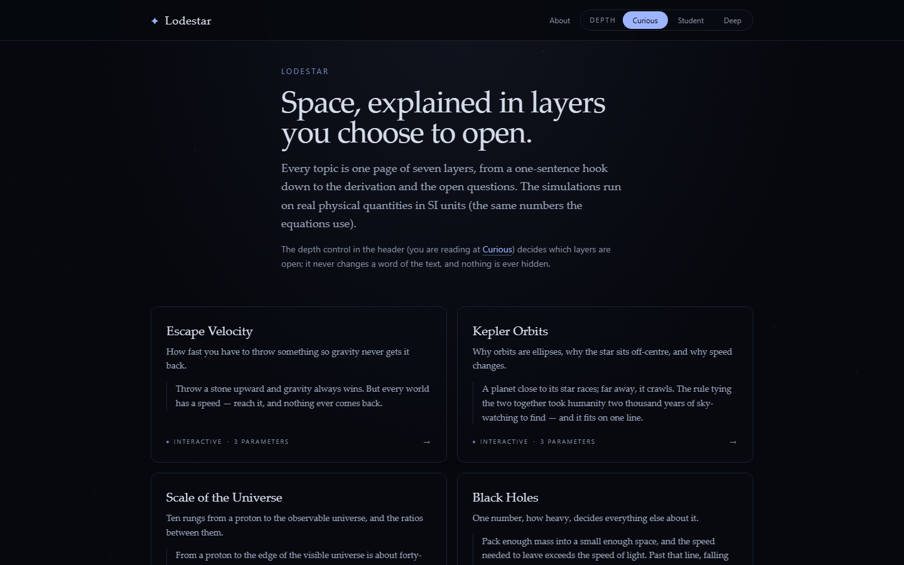
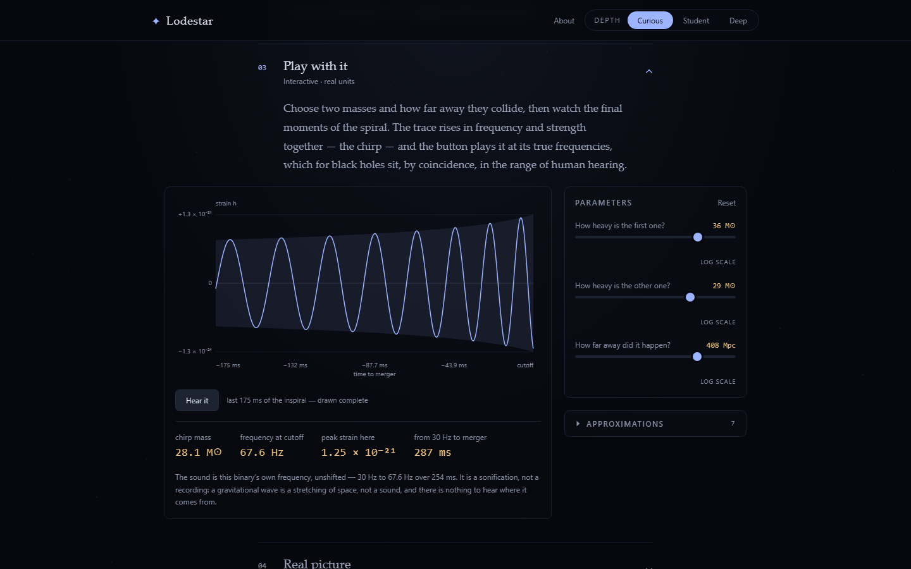

# Lodestar

Interactive astrophysics, explained in seven layers you choose to open.

**Live site: https://lodestar-nu-six.vercel.app**

Lodestar is an astrophysics education site. Every topic is one page of seven layers, from a one-sentence hook, through an everyday analogy and a live simulation, down to the derivation and the open research questions. A depth setting in the header (Curious, Student, Deep) decides which layers start open, and never changes a word of the text, so one module serves both a reader who has never studied physics and a reader who works in the field: the maths is on every page, folded shut by default.

## Screenshots





## Features

- 22 modules, each a seven-layer page: hook, intuition, interactive simulation, real picture, the maths, going deeper, connections. The depth tier persists across sessions via Zustand's `persist`.
- Simulations run on real SI quantities. Every control is a typed `Param` with a unit and a symbol, and the maths layer renders KaTeX from the same `Param` values the animation uses, so the number in the equation is the number in the physics.
- Readouts are recomputed, not tabulated: the gravitational-waves page derives chirp mass, frequency at cutoff, peak strain and time from 30 Hz to merger from `src/physics/gw.ts`.
- A "Start here" learning path on the front page suggests an order through all 22 topics in four stages, checked so that no topic leans on an idea only a later one explains; each module page ends with its step on the path and links to the topics before and after it. The order lives in one data file, `src/content/path.ts`, and a test fails if a module has no place on it.
- Each simulation lists its approximations in a counted expander beside it, not in the prose.
- The gravitational-wave chirp can be heard, synthesised through Web Audio at the binary's own frequencies and labelled on the page as a sonification, not a recording.
- Glossary of 150 entries. Marked terms open a panel placed by a pure geometry function, on hover intent, click, focus or tap, with one `aria-live` region for screen readers.
- Every module closes its "real picture" layer with a licensed photograph or published measurement (22 figures in `public/figures/`, each with 640 w and 1080 w copies), credited on the page.
- All 22 simulations honour `prefers-reduced-motion`: the 21 that animate show a static rendering carrying the same information, and planetary atmospheres never animates.
- Constants follow CODATA 2018 and IAU 2015 Resolution B3, defined once and never inlined. Each module cites five primary references.

## Modules

| Module | The one idea |
|---|---|
| Black Holes | One number, how heavy, decides everything else about it. |
| The Cosmic Distance Ladder | Almost every distance to a galaxy rests on a shorter one, all the way down to the width of Earth’s orbit. |
| The Cosmic Microwave Background | The oldest light there is still fills the sky, cooled by the stretching of space to three degrees above absolute zero. |
| Dark Matter | Stars at a galaxy’s edge orbit too fast for the matter we can see. Something unseen is pulling on them. |
| The Early Universe | From a trillion-degree soup of quarks to the first atoms: what the universe was made of at every moment, and why it changed. |
| Escape Velocity | How fast you have to throw something so gravity never gets it back. |
| Exoplanets | A star dims by a hundredth, on schedule, and there is a world in the way. |
| The Expansion of the Universe | Almost every galaxy is moving away from us, and the farther it is, the faster it goes. |
| Galaxies | Islands of hundreds of billions of stars. When two meet, their stars almost never touch, but gravity pulls both into new shapes. |
| Gravitational Waves | Two black holes fall together, and space itself rings. |
| The Habitable Zone | Around every star there is a ring where water can stay liquid. Being in it is where the question starts, not where it ends. |
| Hawking Radiation | Black holes are not quite black. The small ones glow, shrink, and end in a flash. |
| Kepler Orbits | Why orbits are ellipses, why the star sits off-centre, and why speed changes. |
| Nebulae | A cloud of gas lit from inside by newborn stars glows the way a neon sign does: its atoms are driven to give off light in colours all their own. |
| Neutron Stars and Pulsars | A star’s collapsed core, heavier than the Sun and a city across, sweeping the sky with its beams. |
| Planetary Atmospheres | Whether a world keeps its air is a race between gravity and heat. |
| Scale of the Universe | Ten rungs from a proton to the observable universe, and the ratios between them. |
| Supernovae | How a star dies depends on one number, its mass. Above a line, it ends in the brightest event in its galaxy. |
| Tides | The Moon pulls harder on the near side of Earth than the far side. The oceans stretch both ways, and the sea rises twice a day. |
| Time Dilation | Moving clocks run slow, and so do clocks deep in gravity. It is the one kind of time travel physics is sure of. |
| Why the Sun Shines | The Sun is not hot enough for its protons to touch. They fuse anyway, and the reason is quantum. |
| Wormholes and White Holes | Einstein’s equations allow tunnels through space and black holes run backwards. Nothing we know of can build either. |

## Running it

```bash
npm install
npm run dev        # sanity suite logs to the browser console on boot
npm run lint       # eslint, correctness rules only
npm test           # vitest, 1178 tests in 25 files
npm run build      # typecheck, production build, per-route HTML, sitemap
npm run preview    # serve dist/
npm run e2e        # playwright, needs a deployment (see Tests)
npm run path:audit # forward glossary-term references on the learning path, for review
```

On a clean install with Node 22: lint reports zero issues, `npm test` passes 1178 of 1178, and `npm run build` emits 24 route HTML files (47 total) plus `sitemap.xml`.

<!-- site:case-study:start -->

## Architecture

- **A module is data, not code.** One typed file in `src/content/modules/` (prose as a serialisable AST, params, equations, references) plus one canvas component in `src/sims/`. `src/content/registry.ts` builds both maps with `import.meta.glob`, so adding a module needs no wiring in the shell.
- **One source of truth per quantity.** Formulae and constants live in `src/physics/`, shared by the animation loop, the readouts and the equation renderer. The simulations hold no physics of their own: every simulation imports from `@/physics`.
- **Canvas first.** Simulations draw in `requestAnimationFrame` loops reading refs, so dragging a slider does not re-render React per frame. Sims are lazy-loaded per route.
- **Terms are marked, not re-explained.** A `term` node in the AST is a leaf: visible words plus a glossary id, so a definition cannot come to contain a link or an equation. Its panel is portalled to `document.body` and positioned `fixed`, because every layer body sits inside the accordion's `overflow-hidden`.
- **A sanity suite guards the physics.** `src/physics/sanity.ts` recomputes known quantities (Earth's orbital period, the Schwarzschild radius of the Sun, light travel times: 205 checks in 23 blocks) through the code paths the simulations use, logging on dev boot and asserted in tests.
- **Every route serves its own head.** `scripts/routeHeadsPlugin.ts` emits one HTML file per route at build time from the registry (24 routes, 47 files) plus `sitemap.xml`, so a shared module link unfurls as the module rather than the front page. Each file also carries schema.org data (a `LearningResource` per module, with no author or other personal details) and a `<noscript>` summary, so a crawler that does not run the app still reads the page's subject.
- **Built to fail gracefully.** A chunk that fails to load (a 502, a dropped connection) shows a page with a retry button instead of a blank screen (`LoadErrorBoundary`), and the app manages scroll itself per history entry, so Back returns readers to their place and each in-page jump has an entry of its own. Hashed assets are served as immutable for a year while HTML revalidates on every visit, and `vercel.json` sets the security headers, but deliberately no Content-Security-Policy, because KaTeX and the motion library set inline styles that a wrong policy would silently break.

## Stack

Vite 5, React 18, React Router 6, TypeScript (strict, plus `noUnusedLocals` and `noUnusedParameters`), Tailwind 3, Zustand 5, Framer Motion 11, KaTeX, Canvas 2D. Deployed on Vercel.

## Tests

`npm test` is 1178 Vitest tests across 25 files, in a Node environment:

- the 205 physics sanity checks as assertions;
- equation snapshots, so a formatting change cannot quietly rewrite the maths;
- a copy snapshot pinning every word a reader can see (layers, glossary, About page, captions, credits, alt text), so a copy edit fails until the snapshot is updated deliberately;
- canvas replay of each simulation at phone-to-desktop widths against a recording context, which catches labels drawn outside the frame;
- the sonification synthesised into a buffer with its frequencies measured back out;
- content-structure rules, including that every `term` reference resolves in the glossary and every entry is marked somewhere;
- readout formatting, and tooltip placement at the awkward edges;
- slider stops on every param: the default is a stop and both ends clamp to the exact bound;
- the learning path against the registry: every module on it exactly once, steps numbered without gaps, and every module's declared prerequisites existing, earlier on the path, and free of cycles.

`.github/workflows/ci.yml` runs typecheck, lint, test and build in that order on every push and pull request to `main`, on Node 22; once those pass, a second job runs the Playwright suite on the two Chromium projects against `vite preview` of the build, and keeps the HTML report as an artifact when it fails.

The browser suite is separate: `playwright.config.ts` defines five projects (Chromium at two viewports, WebKit, Firefox, mobile WebKit) covering tooltip journeys, figures, axe accessibility passes, keyboard operability, the not-found route, scroll restoration on links, Back and Forward and in-page jumps, recovery from a chunk that fails to load, and each route's served head and structured data. It starts no dev server, so `baseURL` defaults to the live site and `E2E_BASE_URL` retargets it at a local `npm run preview`.

## Performance

Measured in the lab against `npm run preview`: Lighthouse 13 in mobile mode (simulated slow 4G, 4× CPU), median of three runs per route, and a Playwright frame-rate test at 4× CPU slowdown on a 390 px phone viewport (5 s idle with the sim on screen, then a 3 s slider drag at 60 input events per second).

| | Before | After |
|---|---|---|
| Largest contentful paint, home | 2.14 s | 1.87 s |
| Largest contentful paint, module pages | 2.59–3.20 s | 2.26–2.48 s |
| Largest contentful paint, About | 2.59 s | 2.17 s |
| Total blocking time, worst route (early universe) | 133 ms | 98 ms |
| Cumulative layout shift, every route | 0 | 0 |
| Idle frame rate, lowest module | 56.8 fps | 59.2 fps |
| Slider drag, median across modules | 50.9 fps | 55.5 fps |
| Slider drag, slowest module (early universe before) | 24.4 fps | 44.8 fps (hawking radiation; 50.8 median of four runs) |
| Entry JavaScript, gzipped | 145.1 kB | 23.8 kB |

A returning visitor now loads the scripts from cache, since every hashed asset is served as immutable; and all of these figures are from the lab, not from field data.

Headless Chromium draws canvas without a GPU, so the frame rates are pessimistic; most of a drag's time in the profile is software canvas drawing. What changed: slider ticks re-render only the sim and its readouts, not the page; sims read their size from a `ResizeObserver` instead of forcing a layout per paint; label widths are cached; the early-universe scale factor comes from a table built once (agreeing with the old bisection to about 10⁻¹¹) instead of 240 000 integrand evaluations per frame; the starfield pauses while a sim is on screen; each module's content loads on its own page, with a build-time manifest for the index; framer-motion's features and KaTeX load only when needed; module pages preload their chunks; and figures ship 640 w and 1080 w copies.

## Known limits

Some files are very large and heavily commented: `sanity.ts` is 3031 lines and the largest simulation, dark-matter, 1050 (supernovae, once the largest, is 926), which is awkward for a second contributor to navigate. No unit test renders a React component, so component behaviour is covered by the Playwright suite. CI runs it on the two Chromium projects (a phone and a desktop viewport) against a preview of the build, after the typecheck, lint, unit tests and build; the WebKit, Firefox and mobile-WebKit projects run only locally, so an engine-specific regression in Safari or Firefox is still invisible to CI.

The learning path's order is checked through declared prerequisites: each module lists the topics it assumes in `src/content/path.ts`, and a test enforces that they come earlier. What a test cannot judge, a glossary term used before the topic that teaches it, `npm run path:audit` lists for manual review.

The maths layer's Numbers view substitutes each slider's value in SI base units, because the constants in the equations are SI; a "where" line under each equation gives the slider's own reading (v₀ = 8 km/s beside 8000 m/s in the formula) for every substituted value shown in another unit.

## How the physics was checked

Claims that can be computed are recomputed through the site's own physics code before publication, and the sanity suite keeps 205 of those checks running, through the same code the simulations run, on every test run. Every module's physics was also checked by separate AI reviewers that had not seen it being written, twice for most modules, followed by whole-site audits and one review by a model from a different AI developer. Each correction those reviews found was checked against its primary source before it was applied. No human astrophysicist has reviewed the site yet. Errors can be reported on the repository's [issues page](https://github.com/VelaWind/lodestar/issues).

<!-- site:case-study:end -->

## Licensing

Code is MIT-licensed (see LICENSE). The figures in `public/figures/` are not: each carries its own licence (NASA public domain, CC BY 4.0, or an institutional image policy). The credit is shown beneath the image on its page, and the licence is recorded in the source, beside the figure in its module file. Prose, glossary definitions and captions are the author's.
